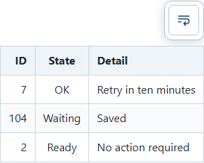

# CARD-0048: no-wrap table sizing investigation and plan

**Finding: candidate 2 is confirmed.** No-wrap columns already size differently
according to their content. The avoidable width comes from the table's
`min-width: 100%`, which stretches short tables to the reading column. Removing
that floor in an isolated browser experiment reduced a representative table
from **724.5px to 292.6px**, with every row staying the same height. That is a
59.6% reduction in the table's rectangular area, achieved without wrapping,
reducing padding, hiding text or changing fonts.

Recommend a small CSS sizing change, with targeted Chromium regression tests
and a README clarification. Selective per-column wrapping is **not required to
fix the measured defect**. It would be a separate feature if the intended goal
is to narrow tables whose unwrapped content already exceeds the viewport.
That intent cannot be established from rendering measurements alone.

This is planning/investigation only. Application source, application tests,
README and `docs/spec.md` are unchanged. The added JavaScript is an investigation
probe under `docs/investigations/`; its counterfactual CSS exists only in the test
browser's memory.

## 1. Scope and tested baseline

The full CARD-0048 description was read from markdown-package board card
`c8f2c0fe-d90c-4a5a-ab7a-c13097a8b92b`, revision count 0, on 2026-09-11.
The full shipped CARD-0045 description and its completion report were also read.
The narrower task brief requires a plan before implementation, so the original
card's request to implement is not executed here.

The inspected checkout was `ceade1dab31f5c6c1f4271e9be7b11e1be9a4f94`.
Its viewer source is unchanged from CARD-0045's final fix commit `57a8350`.
A fresh production build passed V-1/V-2 at **124,848 / 133,145 eager gzip bytes**.

The investigation opened a real generated `.mdpkg` using the production viewer's
file input and clicked the actual per-table controls. It did not substitute
handwritten HTML for the renderer or recreate the table CSS. It ran against both
the fresh local `dist/` and the
[live viewer](https://michal-ciechan.github.io/markdown-package/).
At 17:39 UTC on 2026-09-11, all 96 live table measurements matched the local
measurements exactly. The fetched live `main.js` and `main.css` subsequently
matched the local build byte-for-byte; hashes and timestamps are recorded in
[live verification](table-sizing/results/live-verification.json).

Environment: Windows, Node 24.6.0, Playwright's Chromium **140.0.7339.186**, device
pixel ratio 1, production system fonts, and viewport widths **1280, 800 and 390px**.
Exact pixels are evidence for this environment, not proposed cross-platform test
constants. The narrow run is a Chromium viewport test, not physical phone or
Safari acceptance.

## 2. What the shipped implementation does

The relevant paths are:

- [styles.css](../../src/web-viewer/src/styles.css): wrapped tables use
  `width: 100%; table-layout: fixed`; no-wrap overrides this with
  `table-layout: auto; width: max-content; min-width: 100%` and cell
  `white-space: nowrap; overflow-wrap: normal`.
- [table-controls.js](../../src/web-viewer/src/ui/table-controls.js): the existing
  button toggles `.table-nowrap` on one container. It stores a boolean by document
  path and source position, updates `aria-pressed`, and retains a 44px button.
  There is no JavaScript column-width calculation.
- [markdown-renderer.js](../../src/web-viewer/src/ui/markdown-renderer.js) and
  [reader-view.js](../../src/web-viewer/src/ui/reader-view.js): semantic tables
  sit in a bounded `.table-scroll` inside `.table-container`. The toolbar is
  right-aligned within that outer container.
- [tables.spec.js](../../src/web-viewer/tests/tables.spec.js): existing tests
  cover toggle behavior, containment, selection and state persistence. They
  verify `nowrap` and scrolling, but do not assert that a compact table's columns
  stop at their natural widths.

| Candidate from CARD-0048 | Evidence and verdict |
| --- | --- |
| 1. No-wrap uses equal columns | **Rejected.** The compact table's shipped columns at 1280px are 122.2 / 192.2 / 409.0px. Equal widths belong to the wrapped mode, where the same table is 241.2 / 241.2 / 241.2px. |
| 2. Auto-sizing works but avoidable width remains | **Confirmed.** The 100% minimum distributes surplus reader width over already unequal columns. Removing only that minimum yields 49.2 / 77.5 / 164.8px, matching each column's widest rendered cell plus its existing padding and collapsed border. |
| 3. The desired feature is selective column wrapping | **Not demonstrated as necessary for the measured defect.** Truly wide content remains wide after the floor is removed. Narrowing those tables while retaining readable content requires wrapping or a different presentation policy, and therefore a separate product decision. |

The browser result is consistent with the
[CSS automatic table-layout model](https://www.w3.org/TR/CSS22/tables.html#auto-table-layout),
which considers cell content and distributes surplus width across columns, and
[CSS intrinsic sizing](https://www.w3.org/TR/css-sizing-3/#max-content), which
defines max-content sizing around content without taking soft wraps. The measured
Chromium result, rather than a presumed exact allocation algorithm, establishes
the cause here.

Padding is **22.4px horizontally per cell** (`.7rem` on each side), with collapsed
1px borders. There are no separated-border gaps to recover. With the floor
removed, the probe verified the widest-cell bound for every column of all eight
tables at all three widths. Further shrinking would require reducing intentional
reading space, changing font/content presentation, or permitting wrapping.
There is no evidence supporting a padding reduction for this fix.

## 3. Measured examples

The committed [fixture](table-sizing/fixtures/varying-columns.md) contains eight
tables: compact mixed columns, long prose, a dominant header, inline markup and
unbroken code, twelve short columns, one column, empty cells, and a nested table.
Headers and cells have deliberately different lengths; the widest values occur
in different body rows as well as in headers.

The compact fixture is:

```markdown
| ID | State | Detail |
| ---: | :---: | :--- |
| 7 | OK | Retry in ten minutes |
| 104 | Waiting | Saved |
| 2 | Ready | No action required |
```

Four layouts were measured at each viewport: untouched shipped Wrap; shipped
No wrap after clicking its control; No wrap with only the minimum removed; and
that same counterfactual plus a compact outer wrapper. Each counterfactual starts
from the shipped stylesheet, replacing the preceding temporary style element.

### Desktop, 1280px viewport

The main table scrollport is 724.5px wide. Values below are rounded to 0.1px;
full values, individual cell metrics and checks are in
[measurements.json](table-sizing/results/measurements.json).

| Table | Shipped no-wrap width | Without width floor | Shipped height | Height after either probe |
| --- | ---: | ---: | ---: | ---: |
| Compact mixed columns | 724.5 | 292.6 | 168.2 | 168.2 |
| Long prose | 1144.3 | 1144.3 | 168.2 | 168.2 |
| Header dominates | 724.5 | 367.8 | 126.4 | 126.4 |
| Inline markup / unbroken code | 783.9 | 783.9 | 128.4 | 128.4 |
| Twelve short columns | 724.5 | 526.2 | 126.4 | 126.4 |
| One column | 724.5 | 55.8 | 126.4 | 126.4 |
| Empty body cell | 724.5 | 290.8 | 126.4 | 126.4 |
| Nested table, 663.9px available | 663.9 | 244.2 | 126.4 | 126.4 |

Shipped compact table:


Temporary compact sizing probe, with the same text, font, padding and row heights:



The single-rule probe removes surplus space **inside the table** but leaves its
wrapper at 724.5px and the control at the reader's right edge. The compact-wrapper
probe also reduces that wrapper to 292.6px and aligns the control with the table.
Both preserve the 233.4px wrapper height, including toolbar and its gap. Tables
remain block content, so neither intervention makes the document vertically
shorter or permits prose to flow alongside it.

### Narrower viewports and already-wide content

| Viewport | Main available width | Compact table, shipped → probe | Long prose, shipped → probe | Long-prose horizontal scroll range |
| --- | ---: | ---: | ---: | ---: |
| 1280 | 724.5 | 724.5 → 292.6 | 1144.3 → 1144.3 | 419px |
| 800 | 432.4 | 432.4 → 292.6 | 1144.3 → 1144.3 | 712px |
| 390 | 317.6 | 317.6 → 292.6 | 1144.3 → 1144.3 | 826px |

Neither override caused page-level overflow. Wide tables retained bounded,
working horizontal scrollports. Natural widths were stable across the three
viewports. The one-column table's compact wrapper stops at **57.2px**, slightly
wider than the 55.8px table because its existing accessible toolbar needs that
space. Shrinking the control to match the text is not part of the recommendation.

All nonempty cells in no-wrap mode occupied one text line. Plain rows were
41.8px high, including 24.8px line height, padding and collapsed border. Inline
code can have different font metrics, so “one line” does not imply identical
pixel heights for every kind of content.

The long-prose table illustrates the separate tradeoff. Wrapped mode at 1280px
is 724.5 × 341.8px; no-wrap is 1144.3 × 168.2px. At 390px, wrapped mode grows to
688.9px tall while no-wrap remains 168.2px. Removing the width floor cannot narrow
the 1144.3px unwrapped table: its 1016.5px Explanation column is already the width
required by the longest cell, including reading space.

## 4. Proposed fix and behavioral contract

For fixed text, typography, padding and no soft wraps, each column's lower bound
is the width of its widest rendered header/body cell. The required table width
is the combination of those column bounds and collapsed borders. Every row's
height is the maximum of its cells' line boxes and vertical spacing. A smaller
horizontal bound does not lower that row height.

Interpret the small fix's objective as: **retain the existing minimum line count
and readable spacing, then remove unused horizontal table width**. The 59.6%
area improvement is for the compact example's table rectangle at constant height;
it is not a claim of global width × height optimization over all wrap choices.

Recommended future edits in `src/web-viewer/src/styles.css`:

1. Remove the no-wrap table's forced 100% minimum, with an explicit `min-width: 0`
   if useful to keep the intent clear. Keep `table-layout: auto`, `width:
   max-content`, and `white-space: nowrap`.
2. Give only `.table-container.table-nowrap` a `width: fit-content`, retaining
   its existing `max-width: 100%` and `min-width: 0`, and keep the inner scrollport
   bounded. This is the measured companion change that aligns the control with
   compact content without expanding the page for wide content.

Both changes were tested as temporary overrides; neither is implemented in
application CSS. No JavaScript measurement algorithm, `colgroup`, column cache,
resize observer, text truncation, hard column maximum, new dependency or format
change is needed. The browser continues to account for proportional fonts,
bold headers, inline code, links, late fonts and viewport layout naturally.

Keep wrapped mode's full-width/equal-column behavior and the current per-table
boolean toggle/persistence contract. A no-wrap table may now be narrower than
the reading column; a table wider than it still scrolls. Keep alignment, borders,
padding, zebra stripes, header semantics and the 44px keyboard/touch control.

The compact-wrapper choice moves the button horizontally when the table changes
between full-width Wrap and compact No wrap. Its focused DOM element must stay
the same and keyboard operation must remain stable. This is an explicit visual
tradeoff for keeping the button beside the visible table. If product review
requires a stationary right-edge toolbar, implement the first rule alone and
retain the full-width wrapper; the column-sizing fix still works, but the wrapper
itself is not compact. No answer is needed to produce or hand off this plan;
the recommended default is the measured compact wrapper.

## 5. Selective wrapping: the scope boundary to flag

There is a real small sizing defect, so do not silently turn CARD-0048 into a
column-wrap optimizer. Equally, do not promise that this fix makes all wide
tables fit. If the desired result is “make the long Explanation column narrower
by allowing two or more lines, while IDs and short status cells stay unwrapped,”
that is candidate 3 and requires a follow-on design decision before coding it.

The objective would need to be stated explicitly:

| Desired objective | Implication |
| --- | --- |
| Shortest height without a width limit | No-wrap already supplies one line per cell; allowing wraps cannot improve the minimum line count. |
| Least total height while fitting the available width | A meaningful hybrid objective. Width is a hard constraint and the algorithm allocates widths among wrappable columns, minimizing the sum of row heights. Some code/identifier tables may remain infeasible without scrolling. |
| Smallest width × height | A different objective that can choose more wrapping and different widths; it does not guarantee the shortest table or the least horizontal scrolling. |

If a hybrid is commissioned, the proposed starting point is a separate **Fit**
mode, leaving Wrap and No wrap intelligible. Fit would retain short identifier
columns at their natural width, allocate remaining available width to prose,
wrap at readable opportunities, and keep explicit horizontal scrolling when
unbreakable content makes fitting impossible. It should evaluate total table
height, including the header, because each row is governed by its tallest cell:
independently minimizing each column does not necessarily optimize the table.

A hybrid plan must set code/URL breaking rules, feasible width bounds, handling
of multiple long columns, deterministic tie-breaking, measurement/performance
budgets, resize/font invalidation, and mode persistence. It needs examples where
different rows have their longest text in different columns. No automatic
selective-wrap algorithm or third mode was prototyped or approved in this task.
The browser experiments establish candidate 2; they cannot infer which hybrid
objective a person would prefer.

## 6. Follow-on implementation and acceptance

### A. Add focused browser regression coverage

Extend `src/web-viewer/tests/tables.spec.js` using its existing real
`readerView`/production-layout harness. Cover widths 1280, 800 and 390px with
varying column content and at least one table narrower and one wider than the
scrollport. Prefer inequalities and rendered-content measurements with a 1px
tolerance over hardcoded Windows pixel widths.

Required outcomes:

- Compact No wrap has distinct column widths where content demands it, each
  covering the widest rendered **header or body** cell plus unchanged spacing;
  the table no longer expands merely because unused reader width exists.
- A dominant header, empty cells, inline bold/link/code, one-column tables,
  twelve columns and nested containers preserve content and containment.
- Adding a longer body value enlarges only the column that needs it, subject
  to the browser's collapsed-border rounding. Shortening the former widest
  value allows that column to shrink again. No stale assigned pixel widths.
- Natural-width results are independent of a wider viewport. When the viewport
  becomes smaller than the table, only the table's scrollport scrolls.
- All no-wrap cells retain their line count; existing typography, cell padding
  and row heights are preserved. Assert content is visible/reachable, not clipped
  or ellipsized to satisfy a width assertion.
- For the recommended wrapper change, compact wrapper width is the larger of
  natural table width and toolbar needs, limited by available width; the control
  stays focusable and at least 44 × 44px. Test the button after it moves.
- Space/Enter/tap toggle the same table, each table's state stays independent,
  and source/render switching, document navigation and package replacement keep
  their existing persistence/reset behavior.
- Exact source selection and review quote capture still work across compact
  cells; the CSS change does not insert article text or change the parser,
  source positions, addressing inventory or serialized review data.

The existing suite already covers many persistence/selection cases; reuse it
rather than duplicating those tests. Add only the missing sizing cases. Tests
based solely on unequal widths would miss the actual bug: the shipped version
already passes that weaker assertion.

### B. Apply the scoped CSS and document it

Change the no-wrap sizing rules as above and amend the table section of
`src/web-viewer/README.md` to say that each column fits its widest header/cell,
short no-wrap tables do not stretch to fill the reader, and wide tables continue
to scroll without wrapping. Mention the compact control/table arrangement.
Avoid claiming automatic height optimization or selective wrapping.

### C. Verify and review the actual layout

Run from `src/web-viewer/`:

```powershell
npm test
npm run test:browser
python tests/validate-export.py test-results/browser-review.mdpkg
```

`test:browser` builds the production bundle; retain V-1/V-2 and the current
133,145-byte Review ceiling. Visually inspect compact, nested and wide tables
at desktop/narrow widths, including 200% zoom and keyboard focus after toggling.
Run a real touch/device check if available and label viewport emulation honestly.
No producer, Reader, Reviews API, package-format or `spec.md` changes are needed.

## 7. Evidence and reproduction

Committed investigation artifacts:

- [probe.mjs](table-sizing/probe.mjs): reproducible measurements of the actual
  production app, real input-file/toggle flow and temporary CSS comparisons.
- [varying-columns.md](table-sizing/fixtures/varying-columns.md): complete fixture.
- [measurements.json](table-sizing/results/measurements.json): baseline commit,
  source/build hashes, environment, build report, 12 layouts, 96 table records,
  cell/row metrics, and 100 explicit checks.
- [live-verification.json](table-sizing/results/live-verification.json): live
  run counts, exact local/live measurement agreement, requested asset URLs and
  matching JS/CSS hashes.
- Four screenshots under `table-sizing/results/`: desktop before/experimental
  compact sizing, and narrow long-prose before/experimental sizing. The latter
  pair is byte-identical, consistent with the unchanged intrinsic wide table.

Reproduce from the repository root, with .NET 10/Git and installed viewer
dependencies (use `npm ci` in `src/web-viewer` if needed):

```powershell
dotnet run --project src/generator-cli/src/Mdpkg.Cli -c Release -- pack docs/investigations/table-sizing/fixtures --out .antiphon/task-5661e8e5-sizing.mdpkg --namespace 5661e8e5-c048-4000-a000-000000000001
npm --prefix src/web-viewer run build
node docs/investigations/table-sizing/probe.mjs --package .antiphon/task-5661e8e5-sizing.mdpkg --out .antiphon/task-5661e8e5-rerun
```

If Chromium is absent, run `npx playwright install chromium` from
`src/web-viewer/`. The probe starts and stops its own loopback server on an
available port. To repeat against the live deployment:

```powershell
node docs/investigations/table-sizing/probe.mjs --package .antiphon/task-5661e8e5-sizing.mdpkg --url https://michal-ciechan.github.io/markdown-package/ --out .antiphon/task-5661e8e5-live-rerun
```

The investigation run used the existing Release CLI binary to create the package;
the `dotnet run` form above also works from a checkout without that binary. Pack
reported an eight-entry package and successful built-in validation. Package SHA-256:
`d3cacebe3eeacca20ca2a224aadf53b44c2ca5b5dfc481e7ec9975f965dc2718`.
The generated package and extra live raw report remain scratch outputs; committed
source/probe/results are sufficient to recreate the experiment.

This probe intentionally checks that the **baseline** width floor is present.
After the fix, that baseline assertion should fail; it is investigation evidence,
not the future CI regression suite. Implement the desired acceptance assertions
in the application suite described above. A future live deployment may likewise
produce different measurements; record its revision/assets before comparing.

Validation in this task: **100/100 local probe checks and 100/100 live probe checks
passed; 0 failures**, covering 96 table measurements per run. Production build
V-1/V-2 passed. The four screenshots were checked for the compact/scroll behavior
described above (the two narrow screenshots have identical bytes). The full
application Node/Chromium regression suites were not rerun because application
code was not changed; the targeted investigation and build are the evidence here.

Handoff: implement the measured width-floor and compact-wrapper fix, with the
focused browser tests and README change. Keep selective column wrapping a separate
decision if the requested outcome includes reducing intrinsic wide-table scrolling
or trading height for width.
